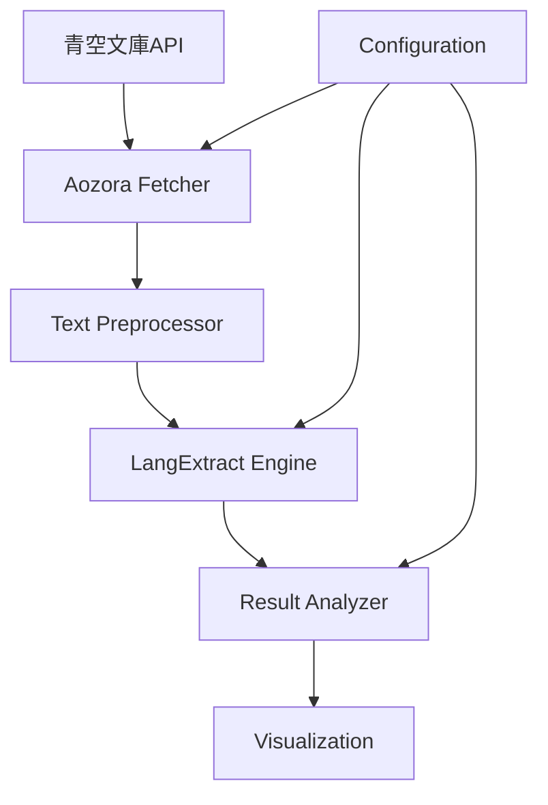

# LangExtract 日本語テキスト解析システム設計書

## 1. システム概要

### 1.1 目的
- Google LangExtractライブラリの日本語テキストに対する挙動調査
- 青空文庫の小説から構造化情報（登場人物、感情、関係性等）を抽出
- 抽出精度と処理性能の評価

### 1.2 主要機能
1. 青空文庫からのテキスト自動取得
2. 日本語テキストの前処理（ルビ除去、正規化）
3. LangExtractによる情報抽出
4. 結果の可視化と分析

## 2. システムアーキテクチャ

### 2.1 コンポーネント構成



### 2.2 データフロー

1. **入力**: 青空文庫の作品ID or URL
2. **取得**: 青空文庫からテキストをダウンロード
3. **前処理**: ルビ、注釈の除去、文章の正規化
4. **抽出**: LangExtractで構造化情報を抽出
5. **分析**: 抽出結果の評価と可視化
6. **出力**: JSON/HTML形式のレポート

## 3. 詳細設計

### 3.1 Aozora Fetcher
```python
class AozoraFetcher:
    def fetch_by_id(self, work_id: str) -> str:
        """作品IDから本文を取得"""
        
    def fetch_by_url(self, url: str) -> str:
        """URLから本文を取得"""
        
    def preprocess_text(self, raw_text: str) -> str:
        """青空文庫形式のテキストを正規化"""
        # ルビの除去: ｜漢字《かんじ》 → 漢字
        # 注釈の除去: ［＃...］
        # 改行・空白の正規化
```

### 3.2 Text Extractor
```python
class JapaneseTextExtractor:
    def __init__(self, model_id: str = "gemini-2.0-flash-exp"):
        self.model_id = model_id
        
    def extract_characters(self, text: str) -> List[Character]:
        """登場人物の抽出"""
        prompt = """
        以下の日本語小説から登場人物を抽出してください。
        各人物について、名前、性別、年齢（推定）、職業、性格を記録してください。
        """
        
    def extract_emotions(self, text: str) -> List[Emotion]:
        """感情表現の抽出"""
        
    def extract_relationships(self, text: str) -> List[Relationship]:
        """人物間の関係性を抽出"""
```

### 3.3 分析対象の抽出項目

1. **登場人物** (Character)
   - 名前（フルネーム、愛称）
   - 属性（性別、年齢、職業）
   - 性格・特徴
   - 初登場位置

2. **感情** (Emotion)
   - 感情の種類（喜び、悲しみ、怒り等）
   - 感情の主体（誰の感情か）
   - 感情の対象
   - テキスト内の位置

3. **関係性** (Relationship)
   - 関係の種類（家族、友人、恋人等）
   - 関係の方向性
   - 関係の強度

4. **場所** (Location)
   - 地名
   - 建物・施設名
   - シーンの場所

5. **時系列** (Timeline)
   - 時代設定
   - 季節・時間帯
   - イベントの順序

## 4. 実装計画

### Phase 1: 基本機能実装（1-2日）
- [ ] プロジェクトセットアップ
- [ ] 青空文庫テキスト取得機能
- [ ] 基本的なLangExtract実行

### Phase 2: 日本語対応強化（2-3日）
- [ ] 日本語特有の前処理実装
- [ ] プロンプトの最適化
- [ ] 複数の抽出パターン実装

### Phase 3: 分析・可視化（2-3日）
- [ ] 結果の評価指標実装
- [ ] インタラクティブな可視化
- [ ] 比較分析機能

## 5. 技術仕様

### 5.1 必要なライブラリ
- langextract
- requests (青空文庫API)
- beautifulsoup4 (HTML解析)
- pandas (データ分析)
- plotly (可視化)
- streamlit (Webアプリ)

### 5.2 LLMモデル選定
- 第一選択: Gemini 2.0 Flash (日本語性能良好)
- 代替: GPT-4o (比較評価用)

### 5.3 評価指標
- 抽出精度（手動アノテーションとの比較）
- 処理時間
- トークン使用量
- 日本語特有の課題（敬語、方言等）への対応

## 6. テストケース

### 6.1 対象作品候補
1. 夏目漱石「坊っちゃん」（登場人物が明確）
2. 芥川龍之介「羅生門」（短編で構造分析しやすい）
3. 太宰治「走れメロス」（関係性が明確）
4. 宮沢賢治「銀河鉄道の夜」（幻想的な要素の扱い）

### 6.2 エッジケース
- 古語・文語体のテキスト
- 方言を含むテキスト
- ルビが多用されたテキスト
- 登場人物が多い長編小説